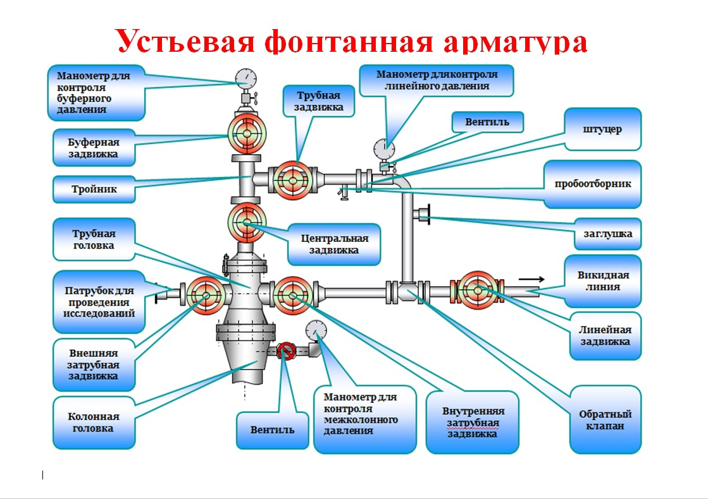
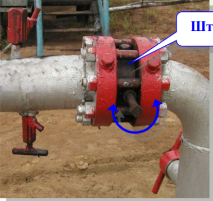

#Устьевая фонтанная арматура

###Колонная головка
Колонная головка предназначена для обвязки устья скважины с целью герметизации межтрубных пространств, а также для подвески обсадных колонн и установки фонтанной арматуры.

###Внешняя затрубная задвижка
Регулирует подачу на патрубок для проведения исследований

##Обратный клапан
Обратный клапан
предназначен для
направления движения
жидкости только в одну
сторону (в сторону выкидной
линии скважины). 

##Штуцер
Штуцер предназначен для поддержания
заданного режима работы скважин
(регулирования потока среды).

###Пробоотборник
Пробоотборник предназначен для
отбора проб жидкости,
поступающей из скважины.

##Патрубок
Патрубок
предназначен для
проведения
промывок скважины
и выкидной линии,
обработок
внутренней полости
оборудования.
Патрубок
герметизируется
заглушкой.

 

###Манометр для контроля межколонного давления
Межколонные давления образуются в результате перемещения некоторой массы флюида из высоконапорных пластов в межколонное пространство (МКП). Высоконапорные пласты могут быть насыщены водой, газом, нефтью. Происходит непрерывное перемещение в первую очередь газа из зон с высоким давлением в зоны низкого давления.

##Трубная головка
Головка трубная предназначена для обвязывания эксплуатационной колонны, подвешивания колонны насосно-компрессорных труб в трубодержателе (подвеска НКТ), контроля давления и управления потоком скважинной и технологической среды в затрубном пространстве, а также для проведения необходимых технологических операций при строительстве, эксплуатации или ремонте нефтяных и газовых скважин.

##Манометр для контроля буферного давления
 давление на устье скважины, измеренное в эксплуатационной колонне или в насосно-компрессорных трубах в шарообразном утолщении устьевой арматуры — буфере, служащем для гашения пульсаций давления. Различают буферное давление динамическое, определенное при фонтанировании скважины нефтью, газом или водой, и буферное давление статическое, измеренное на неработающей скважине.

##Манометр для контроля линейного давления
Нефтепроводы по которым осуществляется сбор нефти от скважин называются сборные коллекторы, давление в коллекторе называется линейным давлением.

##Выкидная линия
Выкидная линия ПВО — промысловый нефтепровод от скважины до замерной установки (АГЗУ, ГЗУ). Предназначены для транспортировки продукта добычи (нефти с попутной эмульсией и газом) либо для транспортировки ремонтно-замерочного оборудования к устью скважины (последний часто применим при разработке морских месторождений).

##Вентиль
Вентиль
предназначен
для установки
манометра
(прибора для
контроля
давления).
Монтируется в
верхней части
обвязки устья
скважины.

